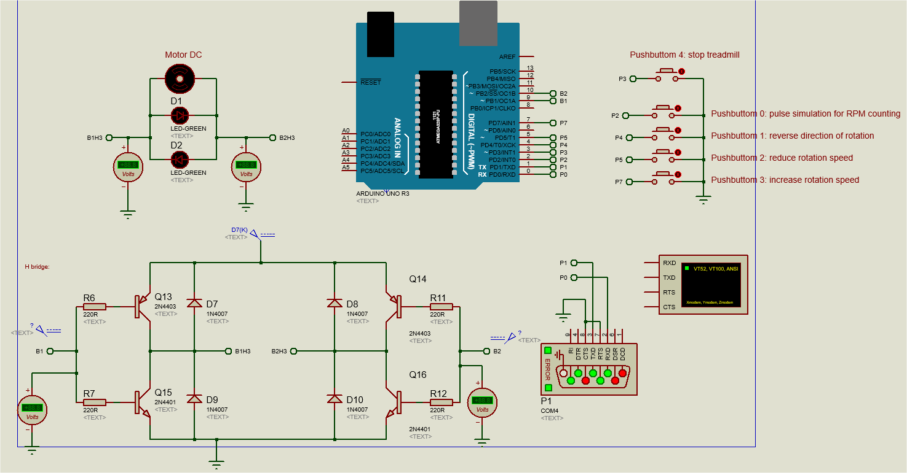
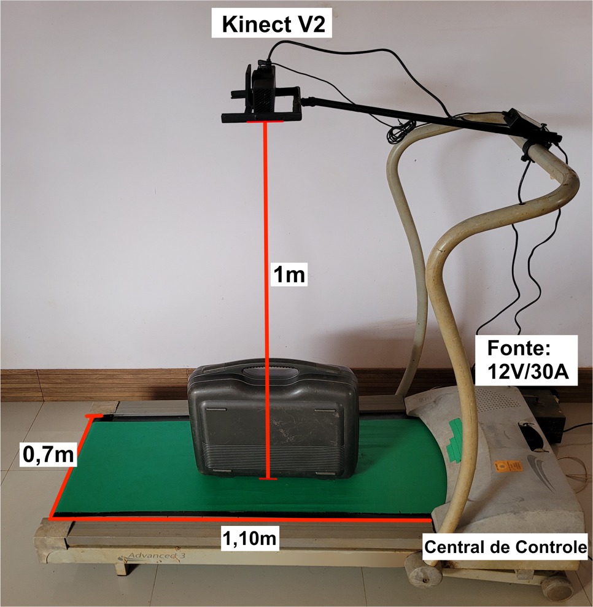

# Código do protótipo de esteira para sistema de medida de bagagens

### Autor: Vitor de Almeida Silva, UFG/PPGEP - 2023

### Breve explicação

O presente repositório contem o código em Arduíno que realiza o controle de uma esteira. O equipamento é usado no experimento de medida de bagagens aeroportuárias com sensor kinect. 

O sistema completo consiste em duas partes, a esteira que movimenta a bagagem abaixo do sensor e o software que coleta os dados e realiza as medidas, este, implementado em Matlab 2020. 

Para acessar o repositório do código do que controla o sensor [clique aqui](https://github.com/Vitor0534/Get_obj_dimensions_Kinect/tree/feat_Interface)

### Como executar o sistema?

Existem duas possibilidades, sendo elas:

* <b>Execução parcial:</b> o sistema foi preparado para permitir execução separada dos módulos, permitindo reutilização da esteira e realização de testes. Para tanto, basta gravar o código em questão no Arduíno e utilizar os controles via botões ou comandos via porta serial (é possível até mesmo testá-lo sem a presença da estrutura da esteira)
* <b>Execução completa:</b> para que o sistema funcione por completo, o Arduíno deve estar integrado ao sistema principal. Logo, é necessário realizar a gravação do Arduíno com o presente código, montar na estrutura da esteira e conectar o mesmo ao usb da máquina que está executando o código em Matlab.

### Esquema do circuito

O circuito da aplicação foi simulado utilizando o [Proteus](https://www.labcenter.com/). O arquivo-fonte da simulação pode ser acessado [clicando aqui](./Resources/prototype circuit simulation), a imagem a seguir é um print do esquema:

### Protótipo da esteira completo

A seguinte imagem mostra a estrutura completa apenas da esteira, é possível notar a presença do sensor kinect v2 na haste de fixação.

### Funcionalidades
* **Controle feedback em malha Fechada:** foi implementado um controlador feedback em malha fechada utilizando interrupção e encoder para controle mais preciso do RPM da esteira. É possível configurar o RPM alvo e o controlador adequa a velocidade alterando o PWM nos pinos devidos;
* **Painel de Controle:** painel físico com quatro botões para configuração da velocidade, sentido de giro e parada da esteira;
* **Serial Controller:** modulo que recebe comandos vindos da porta serial para controle/configuração da esteira em tempo de execução. Utilizado na integração da esteira com o software central de medida de bagagens, permitindo configurações com os seguintes comandos:
	* Comando 's': para a esteira;
	* Comando 'r': retorna o movimento da esteira;
	* Comando 'v,pwm': altera a velocidade alvo da esteira para a indicada;
		* Ex. >> 'v,150';
	* Comando 'h': altera o sentido de giro para horário;
	* Comando 'a': altera o sentido de giro para anti horário;
	* Comando 'c,razao': altera a razão de decremento/incremento do PWM. Quanto mais alto, maior a reação do controlador feedback as alterações e menor a precisão para velocidade alvo. A razão precisa ser múltiplo de 255 por conta dos limites do pwm:
		* Ex. >>"C,15"
	* Comando 'm,RPMmaximo': altera o rpm máximo da esteira e recalcula o rpm alvo.

**Quanto aos cálculos para controle do RPM:**

* Calculo do RPM atual:
	* RPM = 60k/Rt
	  * Rt = tempo de rotação, é o tempo que o motor leva para fazer uma rotação completa em milissegundos
* Calculo RPM alvo:
	* RPM_Alvo = (RPM_Max * PWM_Alvo)/255
* Calculo do RPM atual:
	* RPM_Atual = ( 60000 / (TempoEntreDoisPulsos * QuantidadeDePulsosPara360°DoEncoder ) )

**As 5 principais opções de velocidade e seus valores de RPM**
Ainda que seja possível configurar qualquer RPM, existem 5 opções default, a seguir as velocidades e seus respectivos valores de RPM:
- Velocidade 1 = 51  pwm  | 64  RPM
- Velocidade 2 = 102 pwm  | 127 RPM
- Velocidade 3 = 153 pwm  | 163 RPM
- Velocidade 4 = 204 pwm  | 254 RPM
- Velocidade 5 = 255 pwm  | 318 RPM